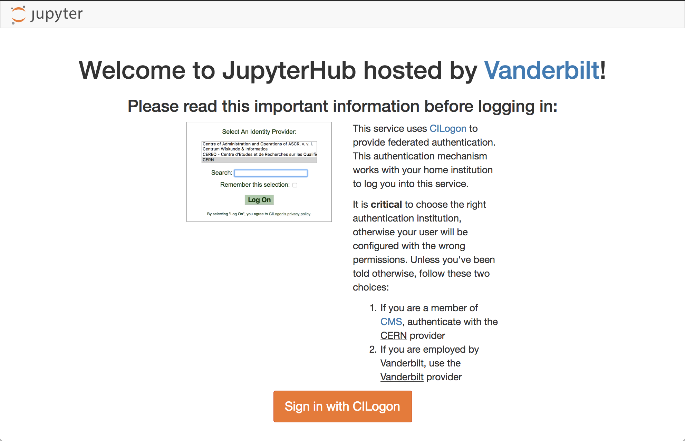
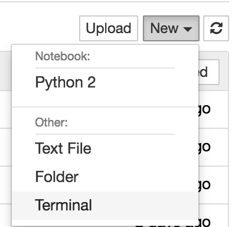
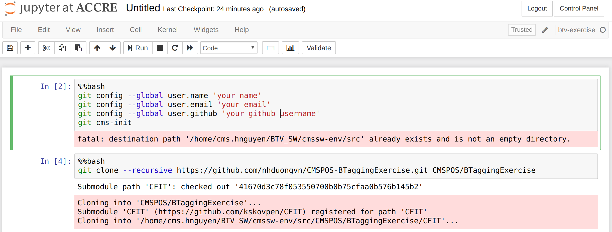

# CMSPOS-BTaggingExercise
BTagging exercise repository for the 2019 CMS DAS at LPC, FNAL

## Setup to run the exercises on Vanderbilt site

1. Login to Vanderbilt JupyterHub
(Copy from https://github.com/PerilousApricot/pyROOTforCMSDAS)  

Point your browser to:

[https://jupyter.accre.vanderbilt.edu/](https://jupyter.accre.vanderbilt.edu/)

If this is the first time using this JupyterHub, you should see:

  

Click the "Sign in with CILogon" button. On the following page, select CERN as your identity provider and click the "Log On" button. Then, enter your CERN credentials or use your CERN grid certificate to autheticate. Choose "Default ACCRE Image v2" at Spawner Option.

Now you should see the JupyterHub home directory. Click on "New" then "Terminal" in the top right to launch a new terminal.

  

2. At terminal, copy your GRID proxy

cd

mkdir .globus

cd .globus/

scp yourusername@lxplus.cern.ch:~/.globus/* .

##test proxy
voms-proxy-init -voms cms

(Note: replace lxplus.cern.ch by the site where you store your GRID proxy. It is cmslpc-sl6.fnal.gov if you store your GRID proxy at FNAL LPC site) 

3. Get environment setup notebook:

At terminal, do

cd

mkdir BTV_SW 

cd BTV_SW

wget https://raw.githubusercontent.com/PerilousApricot/pyROOTforCMSDAS/master/setupLibraries.ipynb

Go back to browser and open the setupLibraries.ipynb (located at BTV_SW folder). Change
CMSSW_VER="9_4_12"
KERNAL_NAME="btv-excercise"

  

Execute the shell!

CMSSW_9_4_12 is loaded to kernal "btv-exercise"

4. Go back to the browser and  open a new notebook with kernel "btv-exercise" setup. This notebook will be used as the bash shell to execute terminal commands in the exercise Twiki.

Follow this picture 

  

  

5. Now start your exercises as instructed in the twiki, for example, git setting and exercises downloading

  

Open the exercise notebooks and continue with the exercises.

PLEASE MAKE SURE THAT ALL YOUR NOTEBOOKS RUN UNDER "btv-exercise" KERNEL (LOOK AT YOUR TOP RIGHT CORNER OF YOUR SCREEN!!!)

